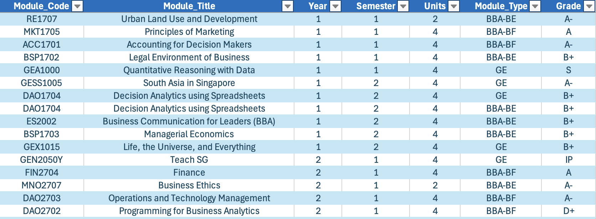

# 👋 Welcome to Gradu-Ate! 📚

### 1. What this dashboard is for?
It is a simple web application containing a dashboard built and styled for NUS BBA (National University of Singapore, Bachelor of Business Administration) students to track their academic progress over semesters.  

The dashboard contains the following features and widgets for users to interact with:  
✅ Cumulative GPA tracker  
✅ Total Units (MCs) taken  
✅ Remaining Credits to Pass/Fail (Remaining S/Us)  
✅ Year of Study  
✅ Degree Completion Rate  
✅ Cumulative GPA Trend over semesters  
✅ Cumulative GPA per Major  
✅ Major Progress Tracker (what you have completed and what else you need to complete)  
✅ Recommended Courses for Main Major  

  

---

### 2. Why the project is useful?
Navigating multiple school websites and portals to track your academic progress can often be confusing, and creating your own Excel template can be time-consuming.  

With Gradu-Ate, you can easily download a ready-made Excel template, fill in your course details as you go, and upload the file into the dashboard to instantly visualize your progress.  

This repository also offers a variety of data sources that you’re welcome to download and use for your own needs.  

---

### 3. How can you get started with this project?
- Firstly, launch the app and you will be directed to a Download Page. If you don't already have a sample formatted excel file, download one! It is important that you use the app's excel template and replace with your own data, to ensure the app works properly.  
  

- In the sample excel file, there are 2 tabs. Please read the `instructions` tab first before modifying the data sheet.  
  

- Once done, click on the `data` tab and start replacing it with your own data! Or, simply use this sample data as a default.  
  

- Once done, go back to the app and proceed to upload your updated excel file.  
  

- If there are no issues with your data, you should see the `Continue to Dashboard` button.  
  

---

### 4. Useful Resources & Links:
- [NUS BBA Specialisations](https://bba.nus.edu.sg/academic-programmes/bba-programme/curriculum-ay2023-2024-for-students-who-switched-ay2024-2025/)  
- [NUS Demand Allocation Reports](https://github.com/Bryce-3D/NUS-ModReg-Reports)
- [NUSMods API](https://api.nusmods.com/v2/)  
- [NUS GE Pillars](https://www.nus.edu.sg/registrar/academic-information-policies/undergraduate-students/general-education/list-of-courses-approved-under-the-ge-pillars)  

---

### 5. Contents of app and repository:
- Run `app.py` contains to render the dashboard  
- Import `user.py` to instantiate the User model  
- Import `utils.py` to access utility functions  
- Import `NUSMODS_API.py` to fetch data from NUSMods API  
- Import `theme.py` to style app pages  
- Run `course_description_from_API.py` to obtain `bba_electives_description.pkl` containing module descriptions for BBA electives  
- Run `extract_demand-allocation_data.py` to obtain `demand_allocation.csv` containing modreg demand-allocation report data  
- Run `popularity_ranker.py` to obtain `bba_electives_ranking.pkl` and `bba_electives_demand_vacancy_data.pkl` containing popularity scores, demand and vacancy data for BBA electives   
- Run `pip install -r requirements.txt` in your terminal to install all necessary packages for this app.

### 6. Where to get help:
As this is a personal project, feel free to email me at my personal email `chowshengyang.123@gmail.com` if you have any issues!

---

Thank you for checking out Gradu-Ate! 🎓  
I hope this dashboard helps you track and plan your academic journey effortlessly.  
If you enjoy the project or find it useful, feel free to ⭐ the repository and share it with your peers!  
**— Chow Sheng Yang**
